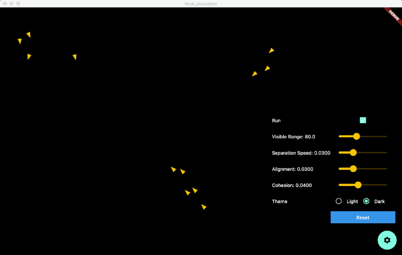

# flock_simulation

This is a simple project to simulate flocking behavior in flutter using boids algorithm,
to explore flutter custom painter function and other stuffs

## Requirements

### for android and iOS
No specify version required, recommend flutter version 1.20.3 or above

### for macos
This project have native macos desktop support, however make sure you have switch to flutter `dev` channel with version `1.22.0-1.0.pre` or above
https://flutter.dev/desktop#set-up

## More information about flocking
- https://en.wikipedia.org/wiki/Flocking_(behavior)
- https://eater.net/boids
